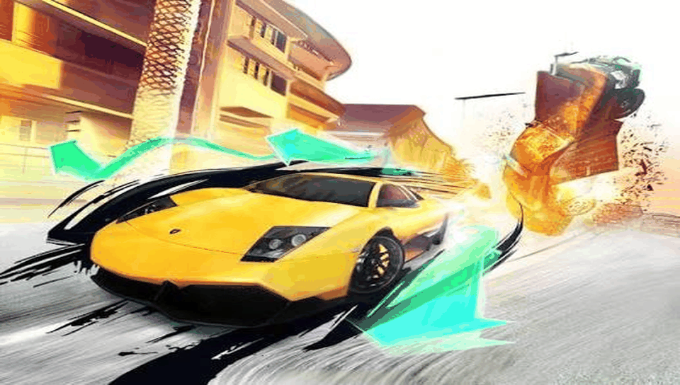

# ASPHALT 5 — PS Vita Port

<p align="center">
  
</p>

<p align="center">
  <b>Native port of Asphalt 5 HD (Gameloft) for PlayStation Vita and PlayStation TV.</b>
</p>

<p align="center">
  
  
  
  
  
</p>

---

## 📖 Description

**Asphalt 5** is Gameloft's arcade racing game, originally released for Android as
`Asphalt-5-HD-v3.4.1.apk`. This port runs the compiled native library (`libasphalt5.so`)
from the Android release directly on the PS Vita's ARM Cortex-A9 processor, using a
dynamic loader (*soloader*) and an Android environment emulation layer (*FalsoJNI*),
with [vitaGL](https://github.com/Rinnegatamante/vitaGL) providing the GLES 1.1
fixed-function rendering backend.

### 🎮 Current Status: Playable (v1.0)

The game **is fully playable from start to finish** with physical controls, full audio and
cutscene video. This is the first non-beta release. See
[`port_progress.md`](port_progress.md) for the full bug-by-bug history, and
[`RELEASE.md`](RELEASE.md) for the release notes.

### 🔧 Fixed since the Beta

- **Nitro fires on a single press** of Cross (or a tap on the icon), whether or not you're
  steering at the same time. The engine only registers a nitro press during a 25 Hz game-logic
  step, and on the Vita some render frames run none, so the press was dropped. It now stays
  queued until the car logic reads it (Bugs #27/#29).
- **The drift skid no longer keeps playing after the drift ends.** A wrong argument in the
  sound-state bridge meant the engine thought the skid had already stopped, so it never sent the
  stop (Bug #30).
- **Race music no longer plays twice at once.** The song was started both on the dedicated music
  voice and on a regular SFX voice (Bug #31).
- **Scenery ambient loops tamed.** Some tracks have animated scenery objects that loop a 13–14 s
  "revving + skidding" clip at full volume from far away. That clip now fades out much faster with
  distance and never goes above 50% volume.
- **Brake and nitro on-screen icons at ~1% opacity** (the physical buttons drive them). Press
  **SELECT** during a race to show them again, or hide them again.
- **Exit actually closes the app** from the pause menu and the main menu (Bug #28).
- **Intro/cutscene video at ~30 FPS** instead of ~10 (Bug #25).
- **No screen-off freeze** while idling in menus (Bug #26).
- **Left analog stick steers**, the internal render resolution is sharper (800x480 instead of
  720x432), Touch Buttons is the default control scheme on a fresh install, and Circle no longer
  duplicates Start's pause mid-race.

### ✨ What Works

- **Native ARM Execution**: `libasphalt5.so` (armeabi/ARMv6) runs directly on the
  Vita's CPU via the soloader, no interpretation/emulation of game code.
- **Boots to Title + Main Menu**: Full JNI lifecycle bootstrap
  (`nativeGetJNIEnv` → `GLResLoader`/`GLMediaPlayer` init → `Asphalt5_nativeInit` →
  `Asphalt5Renderer_nativeInit`) matching the real Android `onSurfaceCreated()` order.
- **vitaGL Graphics Pipeline**: GLES 1.1 fixed-function rendering, with an internal
  800x480 offscreen FBO upscaled to the native 960x544 panel (menu layout still
  reports 800x480 to the engine so UI scaling stays correct).
- **Audio**: Custom 32-bit fixed-point audio mixer with linear interpolation running on the `MAIN` audio port.
  It honors the engine's loop/pitch/volume/stop commands: looped engine sounds track RPM via live pitch updates,
  long music tracks get a dedicated unstolen voice (mirroring the engine's `nativePlaySoundBig` path), one-shot
  SFX live in a 16-voice pool that prefers stealing one-shots over loops, and the master bus uses gain compensation
  (`1/sqrt(N)`) plus a soft limiter instead of hard clipping.
- **Input**: Full physical button support! D-Pad/Analog stick for menus and steering, Cross for nitro, Square for
  brake, Start opens the pause/in-game menu, Circle is BACK in menus only. The router is state-aware
  (title / menu / in-race): synthetic touches share the same 2-slot allocator as real fingers so they can never
  collide, held buttons are cleanly released on state transitions (no stuck "ghost" fingers after a race), and on
  post-race results screens Cross sends both a center-tap (which is what those screens actually listen for) and
  DPAD_CENTER. **Physical controls only work with the "Touch Buttons" control scheme** — see
  [Controls](#-controls) below.
- **Assets from `ux0:`**: Resource loader reads game assets/chunks from `ux0:data/asphalt5/`
  with an LRU cache to reduce SD card stutter.

### 🕹️ Controls

The original game has **four** selectable control schemes in its in-game options menu (Options →
Controls): **Touch Buttons**, **Tilt to Steer**, and two touch-drag variants. This port's physical
button/D-Pad/analog-stick mapping (`source/input.c`) works by simulating taps at the exact screen
coordinates of the **Touch Buttons** on-screen icons — it does **not** read the Vita's motion
sensors, and it does **not** emulate a finger dragging across the screen. As a result:

- ✅ **Touch Buttons** is the only control scheme physical controls work with. This is now forced
  automatically **the very first time you run the port** (before any save file exists) — you don't
  need to change anything in the options menu on a fresh install.
- ❌ **Tilt to Steer** and the two drag-to-steer schemes do **not** work with physical controls and
  should **not** be selected from the options menu — steering (and depending on the scheme, nitro/
  brake too) will not respond correctly if you do, since the physical-input code is aiming at
  on-screen positions that don't apply to those schemes.
- If you ever switch control schemes yourself (or restore a save from the Android version) and
  controls stop responding, go back to **Options → Controls → Touch Buttons**.
- The on-screen brake and nitro icons are drawn at ~1% opacity by default, since the physical
  buttons drive them. Press **SELECT** in-race to show or hide them. Tapping the screen still
  works either way, so touch and physical controls can be used together.

| Vita input | Action |
|---|---|
| D-Pad Left/Right, L/R, or Left Stick | Steer |
| Cross | Nitro |
| Square | Brake |
| Start | Pause / in-game menu |
| Select | Show / hide the on-screen brake & nitro icons (in-race) |
| Circle | Back (menus only — not in-race, so it doesn't overlap with Start) |

### ⚠️ Known Issues

- **Only the Touch Buttons control scheme** works with physical controls (see
  [Controls](#-controls)).
- **Manual standby** with the power button (sleep/resume mid-game) is untested. Idling is safe.
- **Heavy tracks** may drop a few frames at busy moments.
- **Video playback** needs the intro `.mp4` in `ux0:data/asphalt5/data/`. If it's missing, the
  video is skipped instantly instead of hanging.
- If a sound ever seems off, grab a console log. Every new voice is logged as
  `[audio] start sndId=...`, which identifies the exact sound.

---

## 📋 Prerequisites

To run this port on your PS Vita or PS TV, you will need:

1. A PS Vita / PS TV console running Custom Firmware (**HENkaku** or **Enso**),
   firmware 3.60/3.65 or later recommended.
2. [**kubridge**](https://github.com/TheOfficialFloW/kubridge/releases) and
   [**FdFix**](https://github.com/TheOfficialFloW/FdFix/releases) installed as
   kernel plugins (`ur0:tai/config.txt` under `*KERNEL`).
3. [**libshacccg.suprx**](https://github.com/Rinnegatamante/ShaRKBR33D/releases/latest)
   installed in `ur0:data/`.
4. A legally obtained copy of **Asphalt 5 HD v3.4.1** (`Asphalt-5-HD-v3.4.1.apk`,
   package `com.gameloft.android.GAND.GloftA5HD`).

---

## 📦 Installation Instructions

1. Install the `asphalt5.vpk` file on your console using **VitaShell**.
2. On your PC, place `Asphalt-5-HD-v3.4.1.apk` in the project root (or extract it
   into `asphalt5_extract/`).
3. Use **psvita-port-toolkit** (the standalone tool this port is managed with) to
   prepare and transfer the asset files to your console — open the toolkit and
   select "Continuar con un port existente" pointing at this folder.
4. Transfer the resulting game data to `ux0:data/asphalt5/` via FTP or USB using
   VitaShell.

### Final File Structure in `ux0:data/asphalt5/`

```text
ux0:data/asphalt5/
├── libasphalt5.so     <- Native library extracted from lib/armeabi/
├── assets/            <- Game data files (.cnk chunks, packages, etc.)
├── logs/               <- Incremental debug logs (asphalt5_NNN.log)
└── cg/ glsl/           <- Shader cache (created at runtime/build)
```

---

## 🛠️ Building from Source

This port does **not** keep a local copy of `porting_tools/` — all build, deploy,
log, LiveArea, and crash-dump workflows are handled by **psvita-port-toolkit**, a
standalone tool kept outside this repository.

### Build Prerequisites

- **VitaSDK**, fully compiled with softfp usage (`vitasdk-softfp/vdpm`).
- VitaSDK libraries: `vitaGL`, `vitashark`, `kubridge`, `pthread`.
- CMake and Make.

### Build Steps

```bash
cmake -Bbuild .
cmake --build build
```

This produces `build/asphalt5.vpk`. For day-to-day development (build + deploy +
crash-dump parsing), use **psvita-port-toolkit** instead of raw `cmake`/`make`.

---

## 🏗️ Project Structure

- `source/`: Native C/C++ loader (lifecycle, GLES rendering, audio, input, JNI
  resource loader, video).
- `lib/`: Auxiliary libraries (`so_util`, `falso_jni`, `libc_bridge`, `fios`,
  `kubridge`, `minimp3`, `sha1`, `stb`).
- `extras/`: LiveArea assets (`icon0.png`, `bg0.png`, `pic0.png`, `startup.png`,
  `template.xml`), plus `cpuinfo`/`meminfo` and debug scripts.
- `PORTING_PLAN.md`: Living plan — engine findings, JNI export table, checklist.
- `port_progress.md`: Bug-by-bug diagnosis log, one confirmed bug at a time.

---

## ⚖️ Disclaimer

**Asphalt 5** is a registered trademark of Gameloft. The work presented in this
repository is not "official" or produced or sanctioned by Gameloft or any other
registered trademark mentioned in this repository.

This software does not contain the original code, executables, assets, or other
non-redistributable parts of the original game product. The authors of this work
do not promote or condone piracy in any way. To launch and play the game on their
PS Vita device, users must possess their own legally obtained copy of the game in
the form of an `.apk` file.

---

## 👥 Credits and Acknowledgements

- **Gameloft**: Original developers of Asphalt 5.
- **TheFloW**: For `so_util`, `kubridge`, `FdFix`, and foundational techniques for
  loading Android executables on PS Vita.
- **Rinnegatamante**: For `vitaGL` and continued support to the PS Vita porting scene.
- **v-atamanenko**: For `FalsoJNI` and the `soloader-boilerplate` base template.
- **Vita Community**: To all developers and enthusiasts in the PS Vita homebrew community.

---

## License

This software may be modified and distributed under the terms of the MIT license.
See the [LICENSE](LICENSE) file for details.
